# Cat-based Browser Game in PHP

I made this in 2019, so it's really ungood.

## Setting up

I have no idea if this code still works, but to run the page you'll need an Apache web server with PHP installed, as well as mod_rewrite turned on and .htaccess files enabled, as well as a MySQL database.

To set up the database there is a file database.sql that *should* have all of the commands needed for the PHP code. There is also a config.php and at the very bottom ``$db_config`` where the MySQL connection data should be put in.

## Screenshots

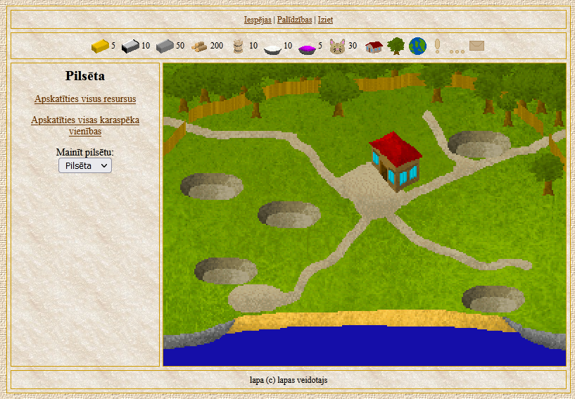
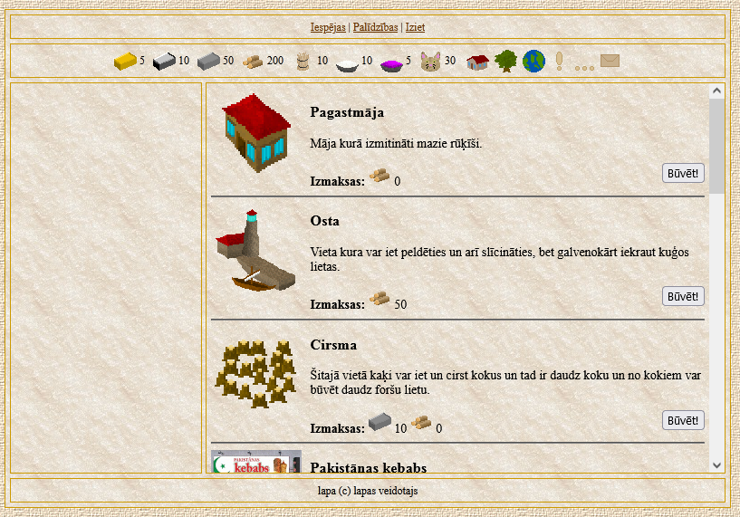
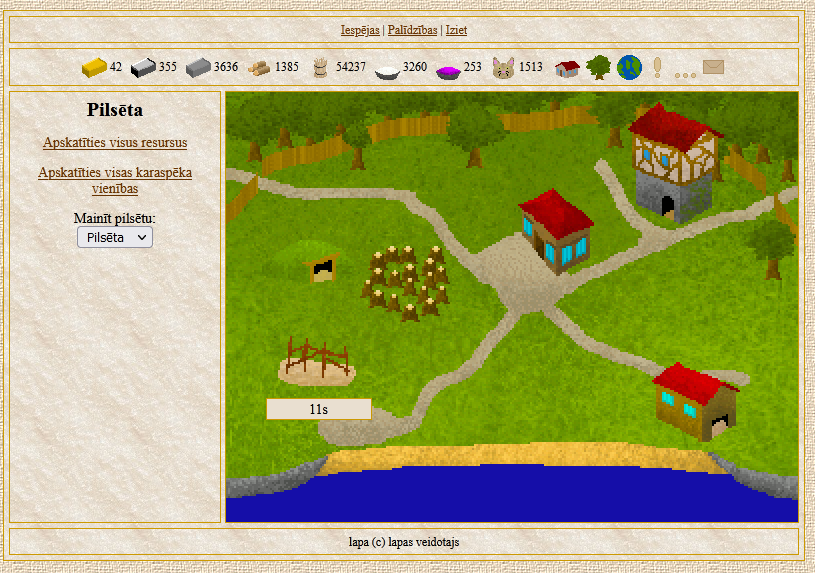
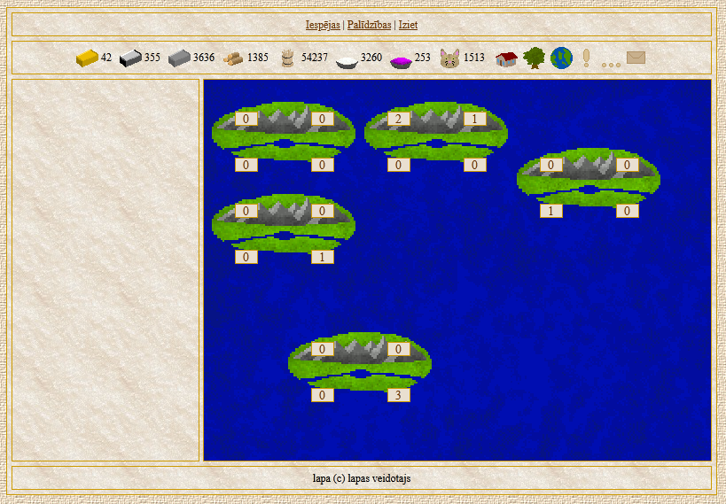
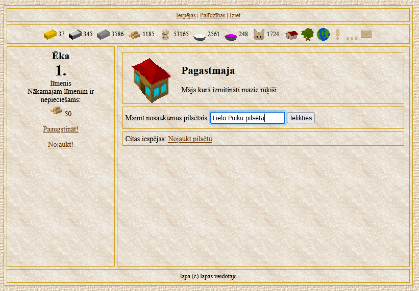
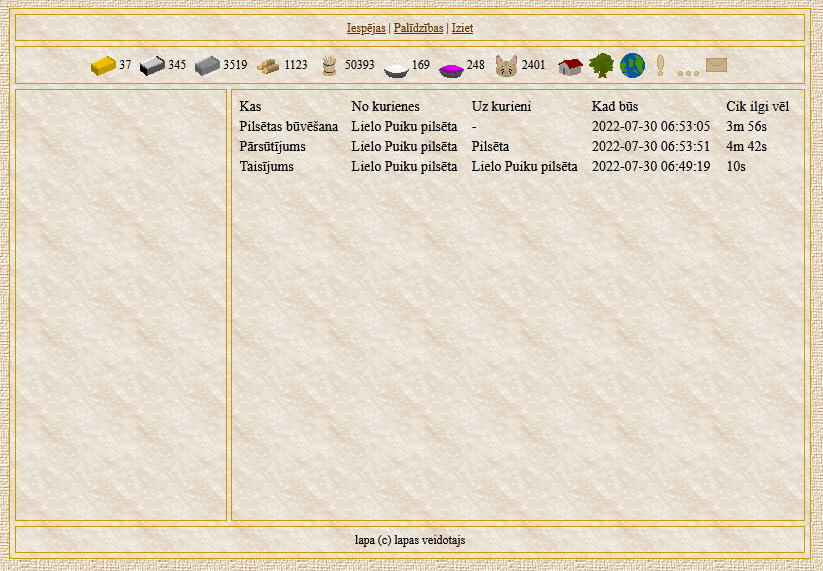
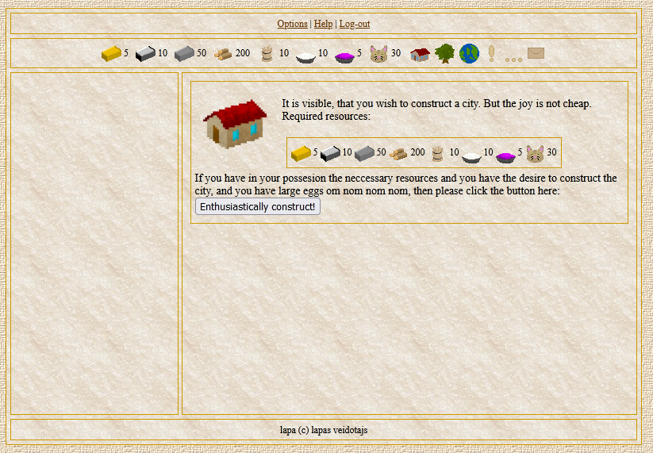
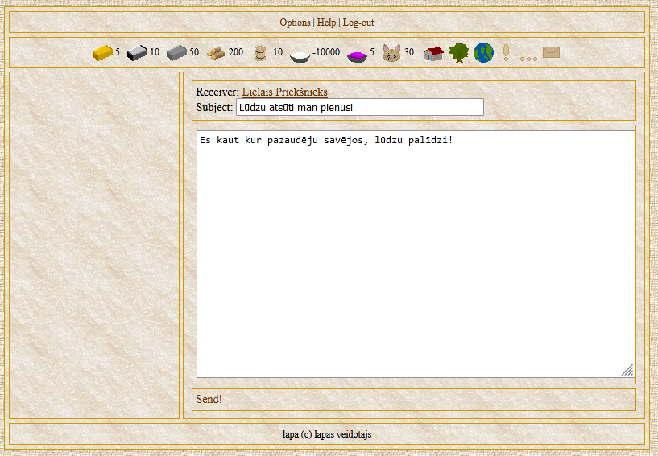
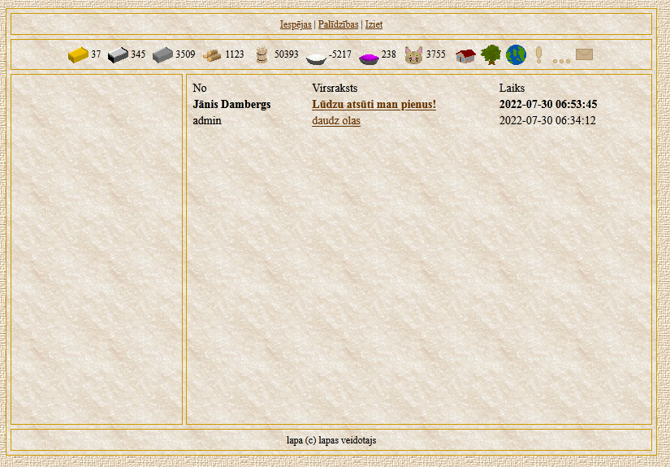
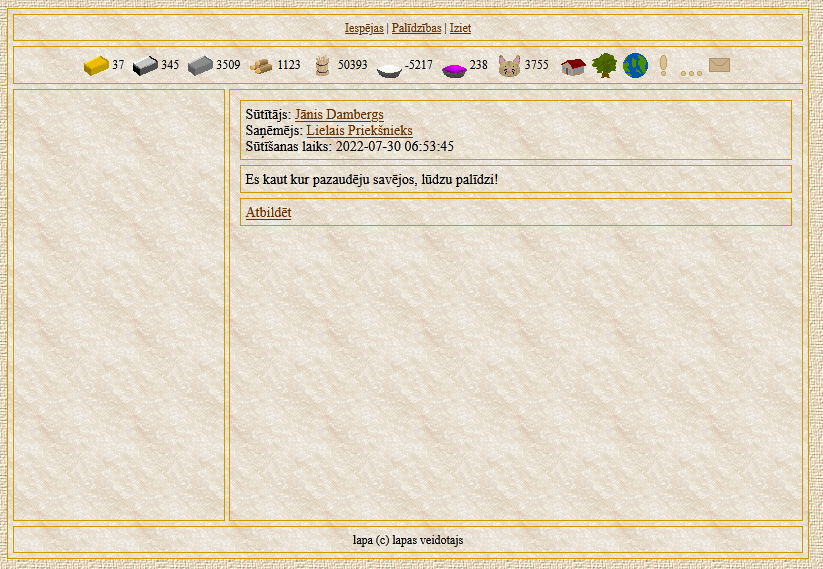
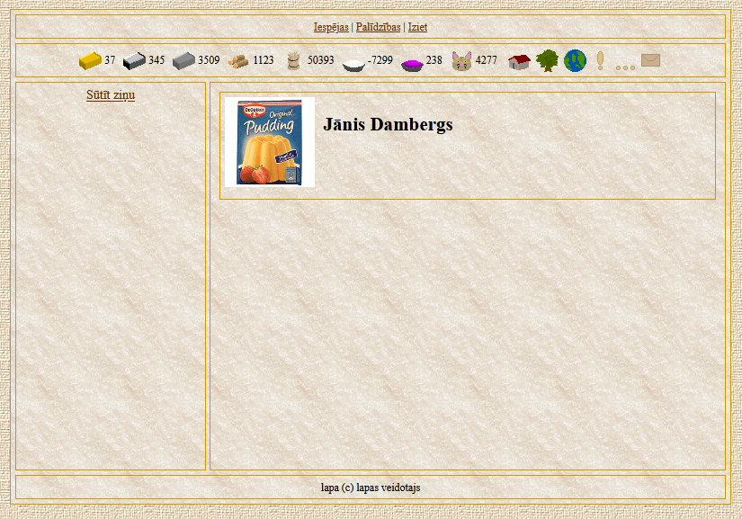
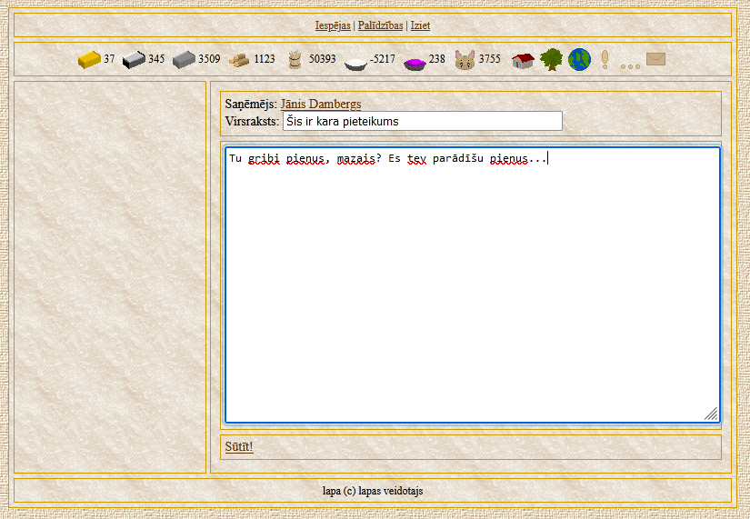
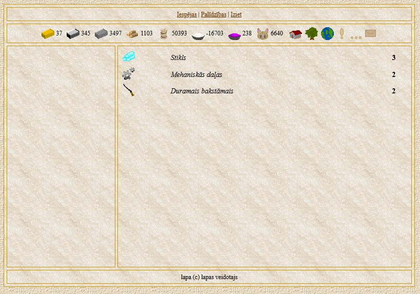
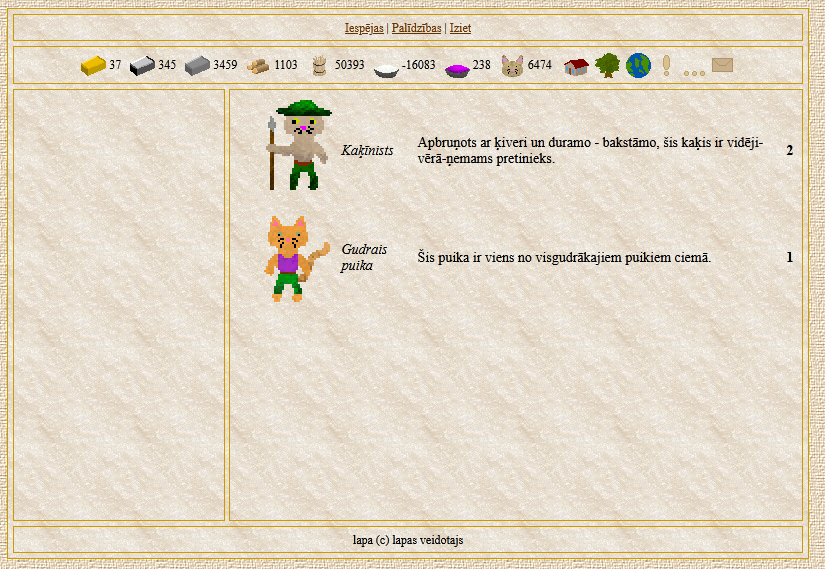
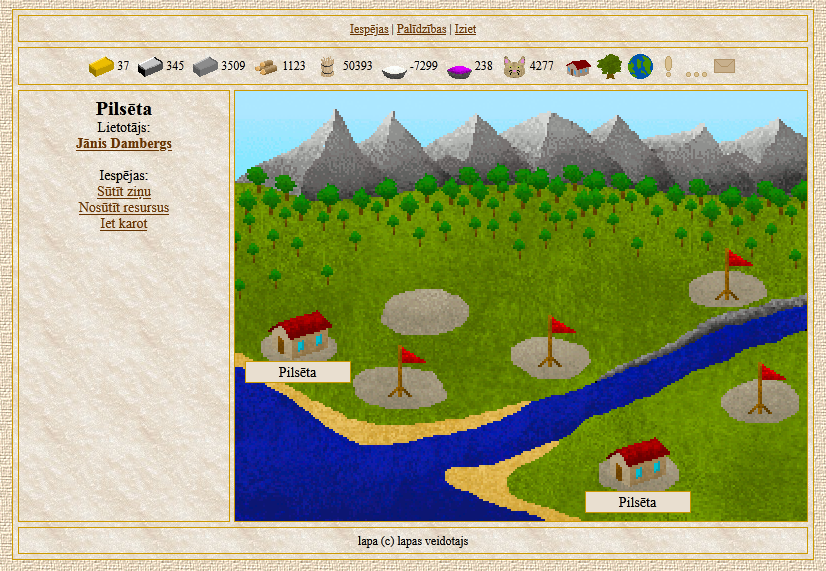
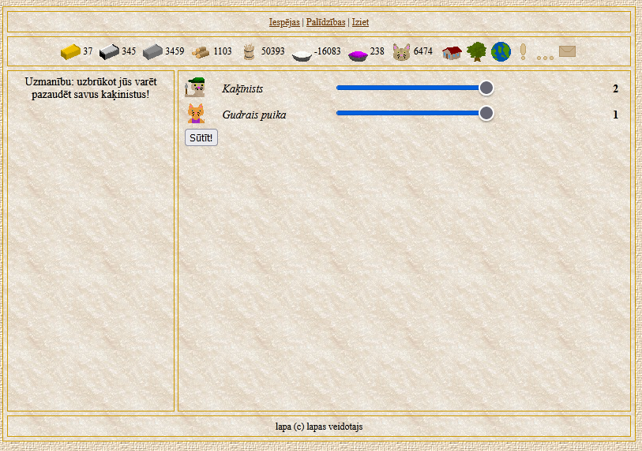
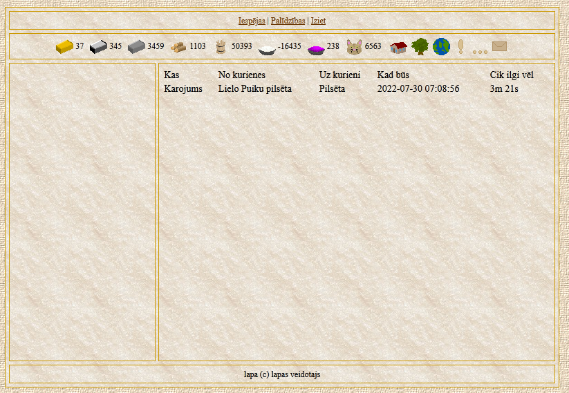
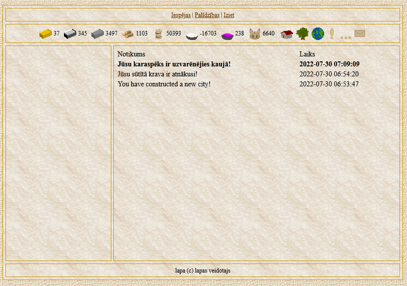